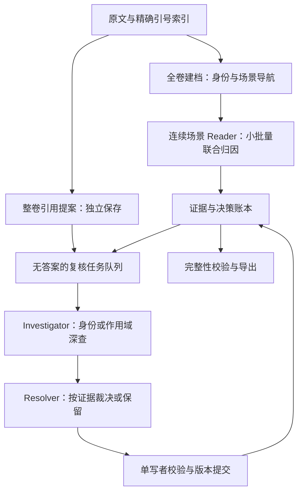

# NovelSpeaker 下一代编排方案：在单卷 12 小时内继续提高准确率

研究完成时间：2026-09-21 09:46，Asia/Shanghai。范围：项目历史、现有生产代码、重构实验代码、五卷已有结果、通用 agent 项目的当前源码。本文是讨论与实施建议，不是已经达到 95% 的实验报告。

## 1. 结论先行

**目前没有证据支持“DeepSeek V4 Flash 在本任务上已经到达 92.77% 的能力上限”。应该继续优化编排，而且优先级相当明确。**

理由不只是还有时间可用，而是原报告存在影响路线选择的统计错误，现有实现也没有完整实现其声称的连续记忆与压缩机制：

1. 本次离线重算发现：新方案共同答错的 203 条中，旧系统实际答对 **116 条**，不是 0 条。三方案共同答错的是 **87 条**。这直接推翻了用“旧系统也完全不会”支持模型瓶颈的论据。
2. 连续多轮与整卷方案的候选联合上界是 **6806/7009＝97.10%**。它只是使用答案计算的诊断上界，不是可部署成绩；但说明达到五卷合计 95%，数学上并不要求先攻克全部共同错误。
3. 当前连续 agent 的压缩器只看到标签，不看到原文证据；还总是取从起点开始的前 100 条。恢复时也不恢复历史对话。这样的实现不能代表成熟 harness 的记忆能力。
4. 工具交互、网络失败和格式修复共用三个循环额度；检索工具仅有按行读取，缺少关键词/实体查找。模型的可用行动空间仍很小。

**建议主线：可恢复的场景阅读会话 + 小批量联合归因 + 独立身份调查 + 按争议调度的证据复核 + 单一提交器。** 保留一次整卷的全局视角作为廉价独立提案，不给它直接覆盖权。所有运行时角色、摘要调用、修复调用仍使用 `deepseek-v4-flash`。

框架上首选 **LangGraph 的持久编排 + LangChain 的 agent/tool 循环，选择性复用 Deep Agents 的压缩/上下文隔离组件**。不把整个 coding CLI 改造成小说系统，也不同时引入五套 agent runtime。PydanticAI 是较轻的备选执行器，应在小型接入验证后择一。本文后面区分“直接依赖成熟库”“借鉴实现机制”“必须自己定义的领域契约”。

12 小时是**每卷端到端墙钟上限**，包括排队、限流、重试、恢复和导出。不能再用“五卷串行 25 小时”否定“每卷 5 小时”的方案。另一方面，未到 12 小时不等于一定还能涨分；正确做法是在这个预算内检验新的信息组织机制，报告准确率—时间曲线，不能把少量负实验外推为模型上限。

## 2. 本次检查了什么，哪些结论仍未实测

独立性说明：本报告未读取或参考 `docs/discussion` 中其他人的当日讨论成果；这些文件不属于本报告的草稿或历史输入，也未被删除、覆盖或修改。本报告的“历史文档”仅指项目根 `docs` 下正文明确列出的演进记录。

### 2.1 本地项目

以[重构现状总览](E:/projects/novelSpeakerV4/docs/重构现状总览_供讨论_2026-09-21.md)为入口，对照重构准备一至八、重构前复盘和历史记忆/场景设计，检查三条代码线：

| 代码线 | 本次关注点 | 判断 |
| --- | --- | --- |
| `E:/projects/novelSpeakerV4/src/` | Boss、Labeler、ShortMem、EvidenceVault、场景和全卷复审、引号索引、评分器、文件原子替换与控制中心边界 | 保留精确定位、证据来源和可靠落盘；淘汰层层投票、按字符串修补的语义裁决 |
| `E:/projects/novelSpeakerV4/novelSpeakV5/src/` | 早期简化的 Labeler/SearchAgent/EvidenceVault 分工 | 不是本轮 DeepSeek 新系统，不能因目录名 V5 就把它当最新架构 |
| `E:/projects/novelSpeakerV4/tmp/deepseek_probe/` | 整卷基线、强制引用、账本、分块、多轮连续、身份归一、分歧精炼 | 当前研究主线；仍是实验脚本，输出协议和持久性不足以直接生产化 |

结构清点覆盖上述源码、测试及 `tmp/refactor_prep` 共 **77 个 Python 文件、28077 行**；详细阅读集中于主执行链、上下文/记忆/工具/评分关键实现及相关测试，不把“建立全项目清单”说成逐行审完每个 GUI 控件或所有历史日志。大型历史日志没有逐字读完，本文历史耗时引用已有报告，本次没有重跑模型。主仓库 HEAD 为 `870f4b3a50aed413229fc6418640f24186b21e35`，未跟踪的实验文件另以哈希冻结。

按项目要求先使用 codebase-memory-mcp 的架构、符号搜索、调用追踪与代码片段。主索引对部分现有文件返回的行号发生偏移，并排除了 `tmp`；因此对实验目录另建索引，并在必要处用实际文件/AST 复核。外部仓库也先建立索引后定位实现。

### 2.2 外部调查

本次实际克隆 **17 个仓库，对应 16 条项目路线**：Letta 入口与 Letta Code 是同一条路线；HoH 只有公开介绍、核心实现尚未发布。对其中 **15 条有实现的路线**读取相关核心模块，不只读 README。所有 checkout 固定到提交 SHA；LangChain 使用 sparse checkout 检出 agent 实现与测试，其余为浅克隆；未安装这些项目的依赖、未执行其安装脚本，也未声称已测完 Windows 集成或本地模型兼容性。

下面所有批量、上下文和时间配额，除明确标成现有实测外，都是**建议起始参数**，必须消融。外部源码能证明机制怎样实现，不能证明移植到小说任务就会涨分。

## 3. 先纠正评测总账

### 3.1 本次复核方法

使用当前五卷答案、原有语义评分函数及 09-01 冻结备份的身份映射，对 `contfull`、`evledger` 与旧输出重新逐条比较；保持 `无人称引语→非人物发声` 的既有归一。评分读取答案仅发生在离线分析进程，本次没有向模型发送答案、旧标签或错误清单。

复算脚本：[audit_local.py](E:/projects/novelSpeakerV4/docs/discussion/2026-09-21_09-46_Agent编排与12小时预算调研讨论_evidence/audit_local.py)。完整计数及输入 SHA-256：[local_audit.json](E:/projects/novelSpeakerV4/docs/discussion/2026-09-21_09-46_Agent编排与12小时预算调研讨论_evidence/local_audit.json)。这能重现旧系统 6602/7009＝94.19%，也能重现报告的 6075/395/336/203 四格表。

| 卷 | 条数 | 连续多轮正确 | 整卷＋账本正确 | 旧系统正确 | 两个新方案都错 | 其中旧系统正确 | 三方案都错 | 实际标签分歧 |
| --- | ---: | ---: | ---: | ---: | ---: | ---: | ---: | ---: |
| 1 | 1349 | 1261 | 1283 | 1313 | 33 | 29 | 4 | 116 |
| 2 | 1425 | 1263 | 1300 | 1380 | 52 | 39 | 13 | 203 |
| 3 | 1215 | 1151 | 1151 | 1163 | 19 | 12 | 7 | 102 |
| 4 | 1561 | 1442 | 1389 | 1429 | 38 | 20 | 18 | 235 |
| 5 | 1459 | 1353 | 1288 | 1317 | 61 | 16 | 45 | 163 |
| 合计 | **7009** | **6470** | **6411** | **6602** | **203** | **116** | **87** | **819** |

`evledger` 当前产物重算为 **91.47%**，`contfull` 为 **92.31%**。文档中的不同时间点曾出现 91.30%、91.44% 等数字；后续应引用 run ID 与输入哈希，不能只引用脚本名。

### 3.2 三个应撤回的推断

**第一，“203 条旧系统全错”不成立。** 116 条旧系统成功案例，最有价值的用途是开发期研究它实际读了什么、用了哪些证据；不是把旧标签装进新 agent 让它抄。其余 87 条也只能称当前三个输出的交集错误，不能称模型不可解集合。

**第二，“731 条就是分歧集”不成立。** 395＋336＝731 是“两个新方案中恰有一个正确”的集合，定义依赖答案。部署时只能用标签差异挑任务。按 `refine_divergent.py` 相同的非人物别名归一，实际标签差异是 819 条：731 条一对一错、56 条双方都错、32 条双方都被宽松评分接受。203 条共同错误中还有 **147 条双方标签相同**，仅查分歧永远发现不了这些错误。

**第三，“达到 95% 必须攻克 203 条共同盲区”不成立。**

```text
连续多轮已正确       6470
整卷独对、连续错       336
两者候选联合正确      6806  = 97.10%
达到合计95%至少正确   6659
从连续基线还需净增     189
```

在完全不修共同错误的理想条件下，选回 336 条中的 189 条且不改坏其他条就可达合计 95%。实际裁决当然不会完美；这个计算只说明“候选选择”和“防回归”值得先投入，并非承诺一个裁决 agent 就能得到 97.10%。净增关系始终是 **修复数－回归数**。

92.77% 的后处理成绩目前来自历史文档。现有 `merge` 目录重算是 6444/7009，不能冒充那次 92.77% 的组合；本次没有找到可直接对应那个最终组合的独立冻结产物，所以不把它当已重新复现的基线。应补存后处理脚本、输入、输出与哈希后再进入正式实验表。

### 3.3 合计 95% 与每卷 95% 要分别验收

原文“至少 95%”应先按更严格目标设计：**每卷都争取 ≥95%，同时报告合计**，不让强卷掩盖弱卷。从当前连续基线出发，每卷达到 95% 至少分别需要净增 21、91、4、41、34 条，合计 191 条；合计门槛则需 189 条。第 2 卷尤其重要，不能只盯第 4/5 卷。

严格名称分数与冻结语义分数都要保留。评分函数具有方向性别名升级、包含关系等宽松条件；不能将字符串归一的收益全部解释为理解能力增长，也不能把其他论文的 B³/F1 与这里的标签准确率直接比较。

## 4. 当前真正需要修的执行机制

以下为源码事实及其风险，不等于已经量化每一项的准确率损失。

### 4.1 连续多轮没有可靠的任务定位契约

[cont_agent.py](E:/projects/novelSpeakerV4/tmp/deepseek_probe/cont_agent.py) 的 `qlines` 只记录行号，发给模型的是 D 编号与行号及 ±8 行。一个原文行有多个引语时，没有给目标文字、字符范围、同一行序号。整卷实验的 roster 也主要是 D 编号→行号。

本次统计五卷有 **16 个多引语行，涉及 34 个引语**。它是确定的歧义入口，但最多涉及这些条目，不能拿它解释全部 539 个连续基线错误。

旧系统已有[quote_occurrence.py](E:/projects/novelSpeakerV4/src/quote_occurrence.py)，提供精确 span、同一行 ordinal、前后作用域与对齐检查，应该复用。注意旧模块 D ID 从 0 起，实验脚本从 1 起，迁移必须显式转换；不要顺便改变空引语或跨行引语的抽取口径。

### 4.2 工具预算不够，而且和失败重试混在一起

`label_one()` 的三次循环同时处理 HTTP 重试、工具调用和输出修复。前两轮可执行工具，第三轮再请求工具时可能进入文本解析，得不到真正的工具结果。一次网络失败就会挤占证据调查的机会。

应分别设置：请求失败重试、语法修复次数、正常调查轮数、单案墙钟 deadline。首遍默认允许 4–8 轮实际调查，困难案允许扩到 12–20 轮，但只在新增证据或尚有可执行检索计划时继续。数字是起始预算，不是要求每案必须烧满。

### 4.3 只有读取工具，没有定位线索的工具

模型若不知道身份揭示在第几行，`read_novel_lines(start,count)` 只能盲找，且一次最多 60 行。应增加全文关键词查找、实体提及列表、章节/场景导航，返回可继续展开的位置。先用确定性文本索引；无须为一卷中文小说先搭向量数据库，更不能因为 embedding 方便偷偷增加第二个执行模型。

### 4.4 当前“压缩”不是完整工作记忆压缩

`distill()` 只看到 `D编号: 标签`，看不到归因证据、角色关系变化、被否定假设、未决任务。`main()` 构造从 `args.start` 至当前的所有结果，`distill()` 却取排序后的 `lines[:100]`。对长卷来说，多次摘要都可能反复总结开头 100 条。

压缩后只留下账本＋20 条标签锚点，没有保留最近完整 user/tool 往返。账本不是持续更新，而是在压缩时才更新；动态 `names` 集合增加一个字符串也不等于增加了有来源的身份知识。

因此“已经试过持续多轮＋成熟压缩，仍达不到”这个论证不成立。需要测的是证据型状态压缩，而不是把已有错误标签再次写成摘要。

### 4.5 断点恢复会改变 agent 的信息条件

checkpoint 仅保存 `ledger/results/recent/cursor`；不保存 messages、工具调用结果、实际 usage、压缩覆盖范围或模型参数。恢复时重建的是更贫乏的会话，和不中断运行不是同一实验。

当前每 50 条写一次，结束时没有单独刷新最终 checkpoint。本次五卷 cursor 分别停在 1301、1401、1201、1551、1451，而最终输出已更靠后。这不代表最终输出丢了，但说明“重启零丢失”的描述不准确：末尾可能重算，且信息状态变了。checkpoint 文件名还不含 tag，存在实验相互覆盖风险。

### 4.6 解析仍能悄悄改变模型原意

`strict_parse()` 有 `cand == n or n in cand`，不是严格结构校验。本次无模型离线探针输入“不是罗伦斯而是赫萝|20|反证”，返回了“罗伦斯”。这说明解析器可以把解释句中的被否定名字当成答案。

应验证结构而非猜字符串：合法 target ID、完整字段、候选 entity ID/新增实体声明、有效证据位置、状态枚举、重复/缺失条目。不要无限加姓名黑名单；也不要把“没有 JSON Schema 接口”理解为“只能宽松解析文本”。本地 Pydantic 校验、工具提交参数校验、有限修复都不依赖服务端原生 schema。

### 4.7 首遍把证据丢掉，复核又重新猜一遍

`sp, _, pt = label_one(...)` 丢弃原始证据输出，最终只保存 D 编号和标签。之后复核无法知道原判依据、用了哪个工具、是否真的见过证据。若再向复核输入前后标签，它看见的主要是未经验证的旧结论，而不是可验证证据。

建议每个 decision 保存证据引用、候选、简短可核查依据和依赖的 fact revision；不要求记录或索取模型隐藏思维链。工具轨迹和返回原文单独留存。

### 4.8 答案和标注流程需要真正拆开

当前实验脚本启动时读取 `answers.txt` 来确定范围，结束时调用评分器，还导入旧的大型 `run_label`。本次未发现这些答案直接进入 `cont_agent` 的模型消息，不能称已发生答案泄漏；但推理与评测进程确实耦合。

新运行器应从原文引号清单决定任务数，只能读本卷原文、允许的索引与本 run 产物。答案、旧标签、error lists、含答案的讨论文档不在工具可达范围内。尤其不能把通用 coding agent 的工作目录直接设成整个现有仓库，然后只靠提示词说“不要看答案”。

## 5. 广泛源码调查：哪些值得借，哪些不值得整套搬

源码引用 R01–R26 的完整固定提交链接见附录；以下每项都对应本次实际 checkout。这里比较的是与本任务有关的机制，不用星数证明可靠性。

| 项目 | 核查实现 | 本项目值得借鉴的部分 | 采用方式与代价 |
| --- | --- | --- | --- |
| Codex | `compact.rs` 的 `build_compacted_history_with_limit`（R01） | 保留近期用户输入、元信息和交接摘要；压缩后的会话仍有可续做任务状态 | 借契约与恢复测试；不移植 Rust CLI，不把 Responses 专用压缩当通用 API |
| OpenCode | 当前 `packages/core/src/session/compaction.ts`（R02） | 前次摘要＋新增历史＋近期窗口；保留目标、约束、活动任务、阻塞与下一步；摘要失败不发布新结果 | 借摘要更新协议与事件；不使用旧文章中过时路径作为实现依据 |
| Pi | `findCutPoint`（R03） | 在合法消息边界压缩，避免工具结果失去对应调用；保留近期片段 | 借消息边界原则；默认本地 token 估算需替换以符合本项目约束 |
| DeepSeek Harness | `region.ts`（R04/R05） | 压缩前后事件、来源 seq、被遮蔽范围、并发状态稳定性检查、失败阶段区分 | 很适合作为事件模型参照；整套 Cordis 插件系统对当前 Python 单人项目偏重，且处于快速迭代期 |
| LazyCodex | `ulw-loop/goal-status.ts`（R20） | 完成由持久目标和验收项决定；被替代目标须等待替代项完成；不能以“输出了一句完成”结束 | 借完成判定和任务台账；不照搬多模型路由或编程角色配置 |
| Deep Agents | summarization/subagents/graph（R06–R08） | 历史卸载后可回读；子任务可隔离或继承上下文；结构化子任务结果 | 与 Python 技术栈匹配，可复用组件；默认通用文件/任务工具必须显式收窄 |
| LangChain | `create_agent` 状态图与 `ToolStrategy`（R25/R26） | 成熟工具循环、middleware、工具式结构输出与 checkpoint 接入 | 与 LangGraph 同一技术栈；必须覆盖默认宽松循环限额并使用 Pydantic 类型校验 |
| LangGraph | SQLite saver（R09） | 带 thread、namespace、checkpoint、parent checkpoint 的恢复；外层状态图 | 优先直接依赖，用于 durable 工作流；领域提交仍须幂等，框架不自动给远端 API exactly-once |
| PydanticAI | PromptedOutput、ProcessHistory、UsageLimits（R10–R12） | 本地结构化输出、请求前历史处理、请求/工具/输入输出预算分离 | 轻量备选 runtime；选择它就不要再叠另一套 worker agent 循环 |
| Mastra | 异步观察策略（R13/R14） | 用旧观察＋新增消息提取增量状态，区分 thread/resource 与后台缓冲 | 借增量观察模式；不能把随意生成的 observation 当事实，仍要证据和提交校验；整套 TS 服务非必要 |
| Letta / Letta Code | 主仓库迁移说明、滑窗压缩（R15/R16） | agent 级持久身份与 conversation 级短上下文分离；滑窗摘要后保留尾部 | 采用记忆作用域思想；当前实现要看 letta-code，不按旧 MemGPT API 直接选型 |
| DeerFlow | executor 容量准入与结果状态（R17） | 进程级子任务容量、排队与运行状态分离、stop reason、trace、工具回执 | 借全局限流和“有部分结果≠正常完成”；不搬浏览器/沙箱/前端 |
| Agno | Team 默认工具（R18） | 团队记忆更新、按需取会话历史、成员取消和委派基础 | 备选团队框架；当前需要确定性调度，不需要每个批次再问一个 LLM manager |
| OpenHands SDK | condenser（R19） | 长历史的事件视图和原子区间；保留头尾与摘要 | 借可回放事件和压缩边界；编程沙箱不是本任务必需品 |
| OpenCode DCP | `deduplicate`（R21/R22） | 按工具名＋规范参数识别重复读取，保护特定工具 | 只借机制；本次 LICENSE 是 AGPL-3.0，不按 MIT 组件复制；对本任务必须把原文哈希加入缓存键 |
| Harness-of-Harness | README（R23） | 计划→执行→检验的持续改进观点 | 本次 checkout 仍写 HoH-lite 将公开，没有可核验核心实现；只列观察名单，不计入可复用代码 |

关于用户提及的 “luckycodex”：公开检索没有确认同名官方实现，本次按最可能指向的 **LazyCodex（code-yeongyu/lazycodex）**展开研究，但不宣称两个名字已被用户确认等同；也没有拿另一个名为 Lucky 的语言项目冒充它。

### 5.1 不能只抄摘要提示词

几个项目共同说明：压缩至少包含**切点选择、原始轨迹保存、摘要生成、状态校验、提交与恢复**。本项目当前只做了“生成一个账本再替换 messages”，遗漏了关键边界。

DeepSeek Harness 的 `commitCompactionBody` 写入 `compaction/summary`，记录 `shadowedRange/shadowedSeqs/usage`，再以 `sourceEventSeqs` 关联替换的会话表面。这种“视图变短、来源不消失”的设计特别适合需要证据审计的标注。

Deep Agents 的 `_aoffload_to_backend` 会保存被摘要的消息并返回可回读路径，但源码允许卸载失败后继续摘要。**小说标注应把这个默认行为收紧：原始证据或轨迹未持久化成功，不能发布压缩替换。** 所以复用不等于默认值照单全收。

Pi 与 OpenHands 关注合法消息/事件边界，能够避免 tool call 与 tool result 被截成半对。其 token 估算实现与本项目“使用 API usage”的约束不同；借的是边界机制，不照搬字符计数。

### 5.2 不能直接把 Deep Agents 的 tools 参数当白名单

R08 的入口明确：传入的 `tools` 是追加，默认包含文件操作与任务工具；`execute` 取决于 backend。要么用框架现有 profile/middleware 正式排除默认工具，要么从更小的 `create_agent` 组装 worker。本文优先后者：可控工具集合更容易验证，也不需要拼一套文件系统权限补丁。

补查 LangChain 源码后还需注意两个默认值：`create_agent` 当前默认递归上限为 9999，不能代替本任务的调用数与墙钟预算；`ToolStrategy` 接收原始 JSON Schema dict 时不会执行同等本地结构验证，应传 Pydantic 模型/已支持的类型，并限制错误修复次数。R25/R26 给出了对应实现。

同时必须显式传模型实例和本地 endpoint。不能依赖 Deep Agents 的默认模型；兼容接入也应强制 Chat Completions 路径，不能因为 provider 名为 OpenAI-compatible 就默认走 Responses。正式选择前验证实际出站 payload，不能仅凭“兼容 OpenAI”四个字。

### 5.3 新项目的启发应进入开发实验，不直接进入运行时自修改

HoH 等持续改进思想适合开发期：冻结假设、运行消融、比较结果、更新下一轮方案。不要让生产标注 agent 在一卷中自行改 prompt、评分规则或工具实现，否则同一 run 内条件漂移，结果不能复现。

## 6. 推荐的运行架构与 agent 职责

### 6.1 一个确定性调度器，五种有明确产物的角色

“五种角色”不是每条对话都调用五个 agent。角色实例按任务触发，同一模型仍可产生不同信息条件。



| 角色 | 负责什么 | 明确不负责什么 | 输入与输出 | 触发/生命周期 |
| --- | --- | --- | --- | --- |
| Volume Archivist 全卷建档员 | 角色候选、别名证据、身份揭示位置、章节/场景导航 | 不逐条裁定全部说话人；不把通用“商人”绑定成全书唯一实体 | 原文→带证据、作用域、状态的 fact proposals 和导航 | 每卷启动一次任务，可分数轮读取；由同模型完成 |
| Scene Reader 连续阅读员 | 顺序读完整交流段，联合标注一小批引语，记录跨句依赖 | 不把自己前一条输出升级为事实；不强制 ABAB | 场景原文＋相关已验证事实→批量 DecisionProposal＋未决问题 | 每个阅读流维持多轮会话；跨输出批次继续，场景切换保留交接状态 |
| Identity Investigator 身份调查员 | 按原文查找某个实体/提及的身份、别名或合并冲突 | 不重标全卷、不按名字相似直接归并 | 明确 entity case＋全文检索→FactProposal、证据和受影响 ID | 按实体案去重；同一案多轮，完成后冻结产物 |
| Scope Investigator 作用域调查员 | 复核引号绑定、前后说话锚点、内心/引用/集体/声响边界 | 不做全量二元分类后删除“非发言”项 | 争议交流段＋原文工具→局部联合解释和支持/反证 | 按相邻争议合并成案，通常 1–8 个核心目标 |
| Evidence Resolver 证据裁决员 | 比较已得到的原文证据，判断修改、保留或继续调查 | 不数票、不因为 reviewer 职位更高就覆盖首遍 | 去掉 agent 名称/票数的提案与引用→可提交变更或 unresolved | 简单案复核后直接校验提交；复杂冲突才独立调用 |

调度、缓存、完整性检查、落盘、词法搜索、证据位置校验全部是普通程序，不要分别包装成会消耗模型调用的“Manager Agent”“Writer Agent”“Token Agent”。

独立整卷引用提案可以复用当前 evledger 路线，作为一个低成本工作任务，不需要新增常驻角色。它不读取 Reader 输出，Reader 首遍也不读取它，减少锚定；候选在复核阶段才汇合。

### 6.2 为何这不等于重演旧系统的多角色失败

旧方案失败的重要原因是信息不对等和无条件改写。本方案要求：

- **独立的是取证路径**：Reader 顺序阅读，身份调查检索远处揭示，作用域调查从后方明确锚点回溯。它们都用同一模型，不宣称统计独立。
- 复核者至少能访问首遍读到的完整原文范围，且可以扩读，不能只拿六句话审判读过全局的首遍。
- 先形成盲取证结果，再打开原判进行对照；只对冲突案付第二阶段成本。
- 同一证据被三个人重复引用只算一个来源，不通过票数增强可信度。
- 拟修改必须带具体 target、旧 revision、新证据或明确的旧证据错绑说明；没有改动依据时输出 unresolved，保留可用首遍。
- 场景内一处错误可能使后续依赖链错位，修的是相应小段及依赖，不无限启动全卷复审。

原文仍然是语义裁决来源。程序只检查证据位置/引用内容、作用域标识、版本与提交完整性，**不再用“证据行含姓名＋说”判断语义正确**。

## 7. 一次处理多少：把三种粒度分开

当前讨论最容易混淆“上下文看多大”“每次输出多少”“隔多久清空会话”。这三个参数应独立。

### 7.1 建议初始配置

| 层次 | 起始值 | 调整规则 |
| --- | --- | --- |
| 阅读范围 | 完整自然交流段；一般先取约 24–64 个引语及中间全部叙述，前后各带相邻交流信息 | 必须可跨范围扩读；长场景保留同一 scene ID，用窗口推进，不假装硬切点是语义边界 |
| 每次归因输出 | 默认 **8 条**连续目标；消融比较 1/4/8/16 | 格式或局部依赖复杂时缩到 1–4；简单且稳定时可到 16，不把 60 条输出与会话重置绑一起 |
| 前瞻/回看 | 目标批次之外默认各 8–16 个引语，包含原始叙述 | 真正边界应由交流结束/身份揭示决定；不能只按引语数截去叙述 |
| 作用域复核案 | 1–8 个核心争议目标，共享一份完整交流段 | 邻近风险合并；扩大上下文不等于扩大必须输出的目标数 |
| 身份调查案 | 一次一个实体关系问题，可带多个提及和受影响目标 | 相同“人物未实名”只查一次并缓存；不要每句话重查同一个女孩 |
| 裁决批次 | 1–8 个共享证据的争议目标 | 无关场景不开同一对话“顺手一起审” |

这些范围是调度建议，不作为 token 计数器。用原文标识/目标数限制任务大小是合法的；用字符数假装 token 占用不是。

### 7.2 多轮上下文怎样持续

Reader 在一个阅读流内持续对话。先送导航、相关身份事实、完整场景；随后只发送新增原文、明确目标列表和相关 fact revisions，避免每条重新塞 ±8 行造成重复上下文。已有可见原文用 span ID 引用，但不把模型从未看过的原文只给一个 ID。

遇到场景切换，记录 scene handoff；如果会话仍健康，不强制清空。跨章节可开新 session，但必须加载有关事实、前场景交接、未决身份与可回查位置。按“60 条就重置”的失败不能证明“小批量输出”失败，前者同时改变了上下文连续性、账本、锚点与解析方式。

身份/作用域调查使用独立 case session，只继承任务包、必要事实与原文证据，不继承父 Reader 的长篇结论。对一个案继续调查应延续原 case session；对另一个不相关案新建 session。

Resolver 默认短会话。一旦连续数轮只有同一批证据的重述，返回未决而不是继续辩论。停止重复不等于放弃整卷：调度器转去其他更可能新增信息的案。

## 8. 工具契约：让模型能调查，也让程序能验证

### 8.1 最小工具面

| 工具 | 必要入参 | 必要返回 | 设计理由 |
| --- | --- | --- | --- |
| `get_quote` | volume、quote_id | 精确引语、line、ordinal、span、正文 hash、前后同句作用域 | 消除“同一行是哪一句”的歧义 |
| `read_passage` | span/scene/line range、cursor | 原文、行号、引语 ID、实际返回范围、截断标志、next_cursor | 返回不足必须可见，不能静默截断关键叙述 |
| `search_text` | query 列表、范围、匹配方式、cursor | 命中位置、短原文、总数、分页 | 支持找身份揭示/称呼，不靠猜行号 |
| `get_entity` | entity_id、可选 scene | 事实 revision、别名作用域、支持/反对证据、冲突 | “可能同一人”与“已确认”可区分 |
| `get_case` / `read_history` | case/event IDs | 旧工具回执、证据、未决事项；必要时分页 | 压缩后仍可恢复细节 |
| `submit_proposals` | 目标集合、DecisionProposal 列表、读到的 revision | 校验结果、逐字段错误、提交收据 | 模型不能直接覆盖 labeled.txt |
| `propose_fact` | 实体关系、scope、引用 | 待验证 fact ID、冲突提示 | 记忆写入有来源，不默认合并 |

工具集合按角色缩小，不把所有工具给每个 agent。只读工具可以在同轮并行；写提案按事务顺序处理。工具名称、参数和结果都用稳定 JSON 契约，错误反馈明确指出如何修复。

### 8.2 DecisionProposal 示例

以下是接口示意，不是声称当前代码已实现：

```json
{
  "quote_id": "v2:D0042",
  "source_hash": "sha256:...",
  "base_revision": 3,
  "quote_kind": "direct_speech",
  "speaker_entity_id": "v2:E0017",
  "status": "proposed",
  "evidence": [
    {"span_id": "v2:L120-L124", "relation": "attribution_binding"}
  ],
  "depends_on": ["fact:F031@2", "decision:v2:D0040@1"],
  "alternatives": ["v2:E0002"],
  "reason": "简短说明哪段原文支持哪项判断",
  "open_questions": []
}
```

`quote_kind` 至少区分实际发言、内心、转述/嵌套引用、语言材料、姿态拟语、环境声、集体、未决；中间类别最后投影到既有评分标签。分类与身份在同一提案中保留，不先用一个低精确率二分类器删除后续归因机会。

若原文出现新角色，允许提出新 entity，而不是被静态名单强迫选错人。实体 ID 与展示名分开：身份合并可以更新 canonical 输出，不需要让每个 agent 对“手下/商行的人”重复争辩字符串。

没有服务端 `json_schema` 时，优先用已有 function calling 的提交工具；如果兼容端对 tool schema 不稳定，则退到提示约束 JSON＋本地校验。格式修复只修协议错误，最多两次，不能静默猜答案。保留错误原响应用于审计。

### 8.3 不再把上下文不足伪装成低置信度答案

允许 `needs_context`、`identity_unresolved`、`conflicting_evidence`。程序记录目标尚未完成，并生成明确下一步，如“查找此泛称的首次自我介绍”“读取右侧锚点至场景结束”。这些状态是可执行队列，不是无限等待的备注。

多轮推理可以开，但按案开启。把一次整卷输出 1400 多条与高推理共用小输出上限，得到截断，不能证明推理没有用。困难案应缩小输出目标，独立给推理/答案足够预算，记录 `finish_reason` 与实际 reasoning usage；用同模型在小批量上做 none/high 对照。

## 9. 记忆层：原文、事实、决策与会话必须分开

### 9.1 五类状态，三个可见层

底层可以先用 SQLite＋不可变原文文件，不需要先建大型图数据库。

| 存储 | 保存内容 | 谁可改 | 是否进入每次 prompt |
| --- | --- | --- | --- |
| Source store | 原文、精确引号索引、hash、章节范围 | 导入器；run 内不可变 | 当前读取范围 |
| Fact store | 实体/别名/关系、有效场景范围、证据、revision、冲突 | 校验后的单写提交器 | 按当前实体/场景检索 |
| Decision store | 每条提案、已选输出、替代候选、依赖、改写历史 | 单写提交器 | 当前目标及必要邻接锚点 |
| Event store | 消息、工具请求/结果、usage、失败、压缩事件 | 框架运行器追加 | 默认不全量装入；可回读 |
| Session view | 当前场景状态、近期完整往返、任务交接摘要 | 上下文构建器 | 是，可压缩 |

模型看到的三层：L1 当前场景原文与近期完整互动；L2 当前实体/争议相关的检索事实；L3 极简全卷导航、有效规范与未决任务索引。不是把全部历史账本在每一次 prompt 中累积。

### 9.2 记忆污染是比“记不住”更危险的问题

事实状态至少为 `candidate / supported / disputed / superseded`。引用在原文存在是语法验证；原文是否支持身份关系仍是语义判断，两者不能混为“verified”。

不能因 Reader 连续把某句标成甲，就把“这段都由甲说”写成硬事实。上一条输出与原文直接归因锚点的权重不同。别名“商人”“女孩”必须有场景/提及作用域，不能全卷一对一哈希映射。

身份揭示可以用于离线全卷的向前回填，但必须指明哪些 earlier mention 属于同一实体；不把后文揭示机械传播给所有同职业人物。记录 `introduced_at`、`revealed_at` 与有效 mention 集合。

### 9.3 更新与失效传播

每个 fact/decision 带 revision，决策记录依赖。身份事实被纠正后，把确实依赖它的目标放回队列；同段 ABAB 链的锚点变了，回访依赖链直到下一个独立原文锚点。不要因为一个人名改了就重标全卷。

多个调查任务可以并行提议，提交时比较 base revision。陈旧提案先重新基于最新事实校验，不直接覆盖。一个写者管理别名关系，避免两个 agent 同时把同一泛称并入不同角色。

### 9.4 冷历史可以检索，长期摘要不承包全部记忆

Mastra 的观察者模式值得借的是“旧摘要＋本轮增量＋作用域”；Letta 值得借的是 agent 与 conversation 状态分层。领域记忆必须保留证据 ID 和冲突状态，而不是自由文本自我总结。

首期用精确关键词、多关键词 OR、人物别名及中文字符 n-gram 索引即可；SQLite FTS5 若采用默认 tokenizer，中文切分效果需单独验证，不能假设开箱即有高召回。只有离线检索覆盖证明不足后再考虑向量检索。

## 10. 上下文压缩：保留可继续工作所需状态，而非只压标签

### 10.1 触发与 token 口径

遵守既有约束：**上下文占用以最近一次 API 返回的 `usage.prompt_tokens` 为实测值，不能把历次 prompt_tokens 累加成当前占用，也不使用字符长度除以 4。** 累计消耗另记 billing/usage 总账。

当前 60 万的统一阈值并未证明最优。建议 Reader 首轮测试 128K、256K、512K 三档软阈值；初始工程配置可用 256K，困难案 case session 可在 64K–128K 观察。它们是使用 usage 实测触发的实验参数，不是模型声明的上下文上限。

API usage 是请求之后才知道的，不能准确预测下一次大工具结果会涨多少。故需保留足够输出余量、限制单次工具返回为可分页完整段、在大规模加载前做已知状态压缩；若发生 context overflow，撤回未提交的超大结果、改为分页恢复。usage 缺失时记录 unknown，不能置零当作上下文很空。

对接现成框架时必须替换默认的本地近似 token 触发器，或使用正式扩展钩子按 usage 发起压缩。短期若框架不能注入该口径，应视为接入不通过，不偷偷违反约束。

### 10.2 压缩的顺序

1. 原始消息和工具回执先持久化。
2. 对重复的相同原文读取去重：缓存键含原文 hash、范围、工具版本；保留可回查指针。不要删当前证据锚点。
3. 把已结束、不相关场景的长工具结果移出 prompt，事实和引用仍在持久库。
4. 从**上次压缩后新增事件**生成 handoff，而不是再次总结开头 100 条。
5. 保留最近 2–4 个完整输出批次及未完成的工具往返；任务正在执行的 tool call/result 必须成对。
6. 校验交接内容和覆盖事件范围，再原子发布新的 session view。

压缩前归档失败、摘要无效、事实引用不存在、scope/版本冲突，均不发布替换；保留原会话，进行有限恢复。不能先清掉 messages 再赌摘要成功。

### 10.3 交接摘要必须包含什么

```text
任务契约版本、volume/source hash、阅读游标与当前精确目标
当前 scene 的原文范围、参与者及独立锚点引用
本次新增/修正事实及 revision；冲突与仍未证实的别名
已提交 decision 范围；尚未提交的提案和状态
未决问题、检索已尝试范围、下一步可执行工具操作
被否定的候选及简短证据指针
recent 完整往返的起点；冷历史索引与压缩覆盖 event IDs
```

摘要不重写所有已完成标签；完整 decision 表独立保存。摘要也不能把 `candidate` 变 `supported`。状态字段由程序从持久库重建，模型只负责需要语义归纳的增量部分，减小摘要幻觉空间。

### 10.4 压缩与恢复必须有自己的质量测试

同一组未见目标，在自然不中断状态、强制压缩后、进程重启恢复后分别继续。检查目标集合、事实引用、工具配对及有效结果一致性；模型输出本身可能有波动，不能要求逐字一致，但应配对比较净收益和错误类型。

必须包含“第 101 条以后才出现的身份揭示”“第二次压缩”“压缩时工具未完成”“摘要写盘中断”“用另一 tag 启动”“尾批不足 50 条”等场景。只验证“程序没报错”不算恢复正确。

## 11. 单卷 12 小时：明确预算、共享吞吐和停止条件

### 11.1 建议的阶段配额

| 阶段 | 初始墙钟配额 | 工作内容 |
| --- | ---: | --- |
| 建档与廉价全局提案 | 0.5 小时 | 导入、索引、角色证据、整卷引用提案 |
| 连续场景首遍 | 3.5 小时 | 8 条一批、连续会话、必要工具调查 |
| 广覆盖独立检查 | 1.5 小时 | 按交流段核查首遍，不只是标签分歧；扫描未决身份、作用域和依赖冲突 |
| 定向深查与裁决 | 4.5 小时 | 优先有信息缺口的争议案；同案共享检索成果 |
| 收尾、故障余量与导出 | 2 小时 | 尾部未决项、完整性校验、有限恢复、稳定发布 |
| 合计 | **12 小时** | 配额可流动，硬 deadline 不变 |

不是所有阶段都必须花到配额；首遍提前完成，节省时间用于有预计净收益的深查。也不因为 4 小时分数平台就说模型极限。如果当前没有新的取证动作，继续重复调用没有意义，应记录为该方案的饱和状态，设计下一组不同机制实验。

### 11.2 用调用预算检查方案是否现实

按一卷 1500 条、每批 8 条举例，纯首遍约 188 批。每批平均 2 次请求约 376 次；身份/导航约 40 次；覆盖检查约 100 次；200 个深查案平均 5 次约 1000 次；100 次裁决/压缩，合计约 **1616 次请求**。

这些都是容量规划假设，必须换成实测分布。若整体有效完成吞吐为 4 次/分钟，调用部分约 6.73 小时；若因共享限流只有 2 次/分钟，就需 13.47 小时，已经超预算，不能靠把并发开大保证完成。单纯 `总请求/吞吐` 也只给粗估，实际还受 Reader 串行依赖和大上下文长尾影响。

通用下界可以写成：

```text
T >= max(关键依赖链耗时,
         总请求数 / 有效RPM,
         实际受限输入token / 有效TPM,
         输出token / 有效生成吞吐)
     + 未被重叠吸收的恢复与导出时间
```

token 不限通常指不限制总消费，并不意味着服务商 TPM/RPM 不限。缓存命中是否计入限流、reasoning 的生成速度与限额要按实际代理遥测确认，不能凭预算宽松推导无限吞吐。

### 11.3 调度策略

- 每卷初始 1 个连续 Reader，1–2 个调查 worker；全局共享请求限流器。完成连续会话的顺序依赖不能用无序并发破坏。
- 先单卷测量，再测 2 卷和 5 卷；逐步增加总并发 1/2/4/8，只有有效吞吐提高、限流等待未恶化才提高。
- 429、超时、网络失败、格式失败分账；集中一层负责退避，避免 SDK×worker×外层调度器重试乘法。
- 复核优先级用部署时可见信号：两个提案差异、未决项、身份冲突、证据缺口、作用域多解、依赖链变更、场景边界。模型自报高置信度不作为免检证书。
- 同标签区也要检查：已知有 147 条双方同错。安排一次分段的独立原文检查，并对相同标签区域做可复现随机抽样；抽样用于估计残留风险，不能直接保证召回所有同错。
- 10 小时后不启动预计无法在剩余时间内结束的长案；11.5 小时后进入封账导出。硬 deadline 覆盖活动请求和取消，不只在下一轮循环才检查。
- 截止时若有未决案，交付完整首遍或已有更可靠决策及单独未决清单。完整率和 unresolved 数必须报告，不得用空标签省略困难项来抬高准确率。

五卷共享一个池时，单卷计时应从该卷正式 admission 起算，同时另报用户提交到最终可得结果的总等待；不能靠让任务一直处于“尚未开始”来掩盖不满足预期的端到端体验。

## 12. 实验怎么做，才能证明是编排改进

### 12.1 先冻结再实验

建立 run manifest：代码/提示词/模型标识、适配器参数、工具与抽取契约、原文/答案/评分器 hash、随机种子、开始结束时间、每阶段 usage。事实库从该 run 原文构建，不能不注明地继承旧系统验证过的身份库给推理使用；旧冻结 vault 仅可在离线评分时沿用以保证历史口径可比。

这五卷已被长期用于调参，不能再称完全未见测试集。按完整场景划分开发/留出，避免一个交流段前半训练、后半验证；有条件应加未参与调参的新卷或新作品作为真正泛化测试。

### 12.2 分阶段消融，不做一次性“全新九层系统”

| 轮次 | 只改变什么 | 核心问题 | 放大条件 |
| --- | --- | --- | --- |
| A0 | 冻结并复现 contfull/evledger/旧结果，定位 92.77% 产物 | 口径与输入是否一致 | 已有离线总账通过，缺失产物明确标记 |
| A1 | 精确 quote ID、严格提交、完整轨迹与恢复 | 先消除协议错误，模型原始判断有没有被解析改坏 | 不再出现静默标签猜测，断点状态可审计 |
| A2 | 输出批量 1/4/8/16，保持阅读范围/模型/上下文策略相同 | 批量联合归因是否优于逐条、吞吐如何变化 | 保护样本不明显恶化，净收益可重复 |
| A3 | 同样批量比较固定 ±8 行与完整交流段/可扩读 | 信息范围是不是关键 | 新证据利用率与归因修复同步上升 |
| A4 | 修复增量记忆；比较不压缩、128K/256K/512K | 真正连续状态与压缩的收益/损失 | 压缩边界附近不显著掉分；恢复后不丢未决任务 |
| A5 | 只加身份调查＋依赖回填 | 旧系统优势中的身份部分能否低成本恢复 | 合并精度、回填净收益为正 |
| A6 | 只加按案作用域取证＋证据裁决 | 能否修复分歧又不破坏正确首遍 | 分歧/同错区域均有评估，净改写为正 |
| A7 | 同案小批量 none/high 推理对照 | 推理预算是否有边际收益 | 计入截断、延迟和重试后仍值得 |
| A8 | 开启全局调度，运行单卷与五卷共享池 | 是否每卷 ≤12 小时且目标分数兑现 | 报告所有卷与总延迟，不只平均值 |

先选若干完整场景，覆盖开头、长对话、身份揭示、嵌套引用、场景切换和普通正确样本；开发期可以用答案分层抽样，但生产调度器不能读取这些错误标签或 ID 清单。对关键候选至少做小范围重复运行，确认涨幅不是单次随机波动，再放大到全卷。

### 12.3 最有价值的旧系统实验

优先离线分析刚找回的 **116 条“新方案都错、旧系统对”**：比较旧轨迹中实际原文读取范围、身份揭示引用、邻接锚点、最后生效层。按自然机制归类，而不是写“第几卷第几条用谁”的特例。

再选开发场景做一个受控对照：同一个 DeepSeek V4 Flash、相同输入与输出契约，分别使用简化 Reader 和旧系统中抽取出的精读取证路径。只接 Labeler/SearchAgent/原始证据访问，不一开始接 9 路审阅和镜像陪审。它能分辨“旧系统更好是提供了不同信息”还是“旧运行偶然答对”。

旧输出只能帮助开发者解释机制，不能作为新生产运行的隐藏第三投票者。若新增数据上仍需调用旧模型，则违反单模型约束，不在推荐路线内。

### 12.4 每次至少报告这些指标

准确率按每卷、合计、严格/冻结语义两种口径；每 100 条窗口和最差自然场景另报。对所有改写列修复、回归、净增；对候选集合列包含正确候选率与选错率；对身份合并列误合并和漏合并；对无人称类别列 precision/recall，并保留内心/引用/集体子类。

运行指标包括完整率、空标签、格式修复、工具失败、调用数、重复读取、API input/output/reasoning usage、排队/限流/请求服务/压缩耗时、恢复次数与未决数。预算逐档比较 2/4/8/12 小时的最佳已提交快照，同一评分器离线打分。

一项机制只有“修了几十条”不够，必须给出改坏几条。例如裁决改了 200 条，修复 80、回归 90，就是净负 10；不能因 agent 更复杂就保留。

### 12.5 何时才能谈瓶颈

只能说“某个固定 harness 在该数据与预算下暂时平台”，需要：运行完整无协议污染、证据范围充分、工具预算未被错误重试吃掉、恢复与压缩可信、候选选择失败和候选召回失败分清，并测到 12 小时内增加不同取证路径仍无稳定净收益。

即便这些满足，也不能证明任何未来编排都无效。当前离这一步还有明显距离。反过来，不能预先保证 95% 必达；本文提供的是有数据支撑的优先路线和可证伪实验。

## 13. 单人开发如何避免再次臃肿

### 13.1 只保留一个 runtime 主线

推荐先做两种很小的适配尖峰，再选一个，不长期维护双引擎：

**方案 A（首选）**：LangGraph 管任务和 checkpoint；LangChain 的 `create_agent` 管工具往返与 worker；Pydantic 定义领域契约；Deep Agents 的摘要/隔离机制在正式扩展点上按需接入。与现有 Python GUI/worker 更接近，持久编排不用重造。

**方案 B（备选）**：PydanticAI 管 worker、PromptedOutput/工具输出与历史处理；持久任务用其支持且通过本机验证的机制或一个现成 durable 调度组件。它对类型和 usage 的接口清楚，但若最终需要自己补齐整套 checkpoint/event replay，则不如 A 符合减少造轮子的目标。

不要把 A 的 worker 循环包进 B 的 worker 循环，也不要再外包给 OpenCode/Codex CLI 一层。一个模型请求出站路径、一个 retry owner、一个 session 状态所有者、一个决定最终标签的提交器。

### 13.2 必须自己的部分与不必自己的部分

| 领域能力，应该自己维护 | 通用能力，优先交给库 |
| --- | --- |
| 精确引号 ID、实体/场景 schema、标注规范 | model/tool 往返循环、消息类型与序列化 |
| 原文读取、关键词/提及索引 | checkpoint、状态图、任务恢复基础 |
| Evidence/Decision/Fact 契约、版本提交与回访 | 通用结构校验、异常类别、有限重试设施 |
| 预算优先级、质量评测和错误归因 | 持久存储连接、并发队列基础、观测事件接口 |
| 面向小说的 handoff 内容与污染控制 | 成熟压缩切点/历史归档机制及其测试思路 |

领域模块可以分为 `source / contracts / agents / workflow / memory / evaluation / cli` 七个边界，开始时不必七个服务。角色差异以配置、prompt、工具集合表达，不复制七份 API 调用代码。

保留现有 GUI、隐藏 worker 启动、备份和 Windows 原子替换经验。GUI 读取统一 progress events，只显示阶段、有效目标数、未决项、预算与恢复状态；不要通过模型自然语言猜测“已完成”。

### 13.3 建议实施顺序

1. **评测与运行隔离**：整理新 runtime 目录与冻结输入，保留当前产物；完成精确 ID/协议检查及 run manifest。
2. **适配尖峰**：实际验证 Flash 的工具多轮、结构提交、usage 映射、reasoning 参数、timeout/cancel；验证框架不会走默认模型、Responses 或额外遥测泄漏原文。这里只选择运行依赖，不做全卷长测。
3. **连续 Reader MVP**：先跑 8 条批次、完整原文窗口、持久消息与单写提交器；保持无复杂复核，建立真正干净基线。
4. **记忆与压缩**：修复增量状态，补足工具配对、压缩事务、恢复；用专门用例验证。
5. **身份案与作用域案**：先各自离线评估，再组合；没有净增益的角色不开默认。
6. **预算与 GUI**：接全局限流、deadline、全阶段 ETA、最后完整导出；再测 12 小时全卷。

版本固定用实际 release/lockfile，本文 checkout 的 HEAD 只是研究证据，不建议不经测试就追所有框架最新提交。对复制的许可代码保留来源与 notice；Mastra 的 `ee/` 区域有独立许可，本次讨论的观察器在该区域之外。DCP 明确只作为机制参照，避免无意引入另一种代码许可证。

## 14. 最终路线选择

本次最强的结论是：**先前“模型能力到顶”的论据不成立；当前仍有具体、可测、且可能在 12 小时内完成的编排改善空间。**

第一优先不是继续堆评审席位，而是恢复真正的工作状态：精确目标、可定位原文、足够工具轮次、完整证据、增量记忆与等价恢复。第二优先是利用已被数据证明的视角互补，让新证据决定小范围改写。第三优先才是增加推理深度与复核覆盖。

建议默认配置从“**8 条一批，完整场景阅读，会话持续，1 个 Reader＋按需身份/作用域调查，单写者提交，usage 驱动压缩**”起步，按 A0–A8 消融推进。所有数字都允许实验推翻，唯独不能再把未验证的摘要实现、损坏解析或错误统计当成模型上限。

## 附录 A：固定提交源码与链接验证

所有外部链接通过 Python HTTP GET 验证；验证结果只保证检查时可访问，不承诺外部网站永远在线。GitHub 行号锚点另外以本地固定提交文件存在性和行数检查，HTTP 200 本身不能验证片段锚点。

### A.1 实际读取的固定提交源码

- **R01** [Codex：重建压缩后历史](https://github.com/openai/codex/blob/75db67bbc6a18200b52698c8870adaedd7746dea/codex-rs/core/src/compact.rs#L687)
- **R02** [OpenCode：旧摘要、增量历史与近端窗口](https://github.com/anomalyco/opencode/blob/17b76788754736b118fa6779a02936286f66aa61/packages/core/src/session/compaction.ts#L145)
- **R03** [Pi：合法压缩切点](https://github.com/earendil-works/pi/blob/890f920884f6d21fc7617d236ef9e1cc5d7a0ef8/packages/coding-agent/src/core/compaction/compaction.ts#L418)
- **R04** [DeepSeek Harness：压缩事务与状态校验](https://github.com/deepseek-ai/deepseek-harness/blob/ddefc45fbc7f8e46dd73185e68295696d1297887/packages/compaction/compaction-basic/src/region.ts#L221)
- **R05** [DeepSeek Harness：摘要事件及来源序列](https://github.com/deepseek-ai/deepseek-harness/blob/ddefc45fbc7f8e46dd73185e68295696d1297887/packages/compaction/compaction-basic/src/region.ts#L472)
- **R06** [Deep Agents：压缩前历史卸载](https://github.com/langchain-ai/deepagents/blob/a764619aa8c850bc75e2e916cf53a587637d8c81/libs/deepagents/deepagents/middleware/summarization.py#L1289)
- **R07** [Deep Agents：隔离或继承上下文的子任务](https://github.com/langchain-ai/deepagents/blob/a764619aa8c850bc75e2e916cf53a587637d8c81/libs/deepagents/deepagents/middleware/subagents.py#L581)
- **R08** [Deep Agents：装配入口与工具默认值](https://github.com/langchain-ai/deepagents/blob/a764619aa8c850bc75e2e916cf53a587637d8c81/libs/deepagents/deepagents/graph.py#L271)
- **R09** [LangGraph：带父版本的 SQLite checkpoint](https://github.com/langchain-ai/langgraph/blob/ed384f3a124660db6dccd6c53eaad48e1457e0b5/libs/checkpoint-sqlite/langgraph/checkpoint/sqlite/__init__.py#L387)
- **R10** [PydanticAI：PromptedOutput](https://github.com/pydantic/pydantic-ai/blob/c4898abb54dc25ae6f6aef208a4c0661b30a455e/pydantic_ai_slim/pydantic_ai/output.py#L214)
- **R11** [PydanticAI：请求前历史处理](https://github.com/pydantic/pydantic-ai/blob/c4898abb54dc25ae6f6aef208a4c0661b30a455e/pydantic_ai_slim/pydantic_ai/capabilities/process_history.py#L26)
- **R12** [PydanticAI：请求数、工具数与 token 限额分离](https://github.com/pydantic/pydantic-ai/blob/c4898abb54dc25ae6f6aef208a4c0661b30a455e/pydantic_ai_slim/pydantic_ai/usage.py#L446)
- **R13** [Mastra：增量观察与异步提取](https://github.com/mastra-ai/mastra/blob/ad9e51e842d5e326a40f6271f64b7b6e58f5d252/packages/memory/src/processors/observational-memory/observation-strategies/async-buffer.ts#L59)
- **R14** [Mastra：分区许可证说明](https://github.com/mastra-ai/mastra/blob/ad9e51e842d5e326a40f6271f64b7b6e58f5d252/LICENSE.md#L1)
- **R15** [Letta：现行源码迁移说明](https://github.com/letta-ai/letta/blob/5bcdd177d70fa2b31a754cfcd801e77b2e1ab16a/README.md#L1)
- **R16** [Letta Code：保留尾部的滑动窗口压缩](https://github.com/letta-ai/letta-code/blob/fb34d2023b6eca8c816134b3dab55b1bf317f52d/src/backend/local/local-backend.ts#L869)
- **R17** [DeerFlow：全局子任务执行容量](https://github.com/bytedance/deer-flow/blob/29d285731b326a728a9df33d3641f73b68bbe48b/backend/packages/harness/deerflow/subagents/executor.py#L1357)
- **R18** [Agno：团队记忆与任务工具](https://github.com/agno-agi/agno/blob/dc86cf20d254efea68fb03784c38264d08a86908/libs/agno/agno/team/_default_tools.py#L128)
- **R19** [OpenHands SDK：事件原子边界压缩](https://github.com/OpenHands/software-agent-sdk/blob/856d99d48e4b11c70c5f1cab21e7830570dbc324/openhands-sdk/openhands/sdk/context/condenser/llm_summarizing_condenser.py#L249)
- **R20** [LazyCodex：持久目标、验收与完成状态](https://github.com/code-yeongyu/lazycodex/blob/1372b0124688b792b8f04618bf72aa08a8d0aa46/plugins/omo/components/ulw-loop/src/goal-status.ts#L1)
- **R21** [DCP：按工具签名去重](https://github.com/Opencode-DCP/opencode-dynamic-context-pruning/blob/d637981555a18c3992472268a0657a948925d5fa/lib/strategies/deduplication.ts#L12)
- **R22** [DCP：AGPL-3.0 许可证](https://github.com/Opencode-DCP/opencode-dynamic-context-pruning/blob/d637981555a18c3992472268a0657a948925d5fa/LICENSE#L1)
- **R23** [HoH：实现尚待公开的说明](https://github.com/Flesymeb/HarnessOfHarness/blob/c0ee1fd362ecaff67e614ad16b492b3d1f1ac6c1/README.md#L1)
- **R24** [OpenAI 官方压缩文档（不是 DeepSeek 接口能力承诺）](https://developers.openai.com/api/docs/guides/compaction)
- **R25** [LangChain：模型/工具循环、middleware 与 checkpoint 接入](https://github.com/langchain-ai/langchain/blob/4af7ab8fcb98c2dc211d9e34cddedffa23eba4d9/libs/langchain_v1/langchain/agents/factory.py#L840)
- **R26** [LangChain：ToolStrategy 与本地结构校验边界](https://github.com/langchain-ai/langchain/blob/4af7ab8fcb98c2dc211d9e34cddedffa23eba4d9/libs/langchain_v1/langchain/agents/structured_output.py#L192)

### A.2 仓库与版本冻结

| 仓库 | 本次提交 SHA | 提交时间 |
| --- | --- | --- |
| [openai/codex](https://github.com/openai/codex) | `75db67bbc6a18200b52698c8870adaedd7746dea` | 2026-09-21T01:19:40Z |
| [anomalyco/opencode](https://github.com/anomalyco/opencode) | `17b76788754736b118fa6779a02936286f66aa61` | 2026-09-21T08:40:48+08:00 |
| [code-yeongyu/lazycodex](https://github.com/code-yeongyu/lazycodex) | `1372b0124688b792b8f04618bf72aa08a8d0aa46` | 2026-09-20T18:38:52Z |
| [deepseek-ai/deepseek-harness](https://github.com/deepseek-ai/deepseek-harness) | `ddefc45fbc7f8e46dd73185e68295696d1297887` | 2026-09-17T21:19:19+08:00 |
| [earendil-works/pi](https://github.com/earendil-works/pi) | `890f920884f6d21fc7617d236ef9e1cc5d7a0ef8` | 2026-09-21T01:14:53+02:00 |
| [langchain-ai/deepagents](https://github.com/langchain-ai/deepagents) | `a764619aa8c850bc75e2e916cf53a587637d8c81` | 2026-09-20T20:30:33-04:00 |
| [langchain-ai/langgraph](https://github.com/langchain-ai/langgraph) | `ed384f3a124660db6dccd6c53eaad48e1457e0b5` | 2026-09-20T12:50:31-07:00 |
| [pydantic/pydantic-ai](https://github.com/pydantic/pydantic-ai) | `c4898abb54dc25ae6f6aef208a4c0661b30a455e` | 2026-09-18T21:42:06-06:00 |
| [mastra-ai/mastra](https://github.com/mastra-ai/mastra) | `ad9e51e842d5e326a40f6271f64b7b6e58f5d252` | 2026-09-21T00:57:52Z |
| [letta-ai/letta](https://github.com/letta-ai/letta) | `5bcdd177d70fa2b31a754cfcd801e77b2e1ab16a` | 2026-09-10T10:59:06-07:00 |
| [bytedance/deer-flow](https://github.com/bytedance/deer-flow) | `29d285731b326a728a9df33d3641f73b68bbe48b` | 2026-09-21T07:34:09+08:00 |
| [agno-agi/agno](https://github.com/agno-agi/agno) | `dc86cf20d254efea68fb03784c38264d08a86908` | 2026-09-21T03:29:02+05:30 |
| [OpenHands/software-agent-sdk](https://github.com/OpenHands/software-agent-sdk) | `856d99d48e4b11c70c5f1cab21e7830570dbc324` | 2026-09-20T19:00:59Z |
| [Flesymeb/HarnessOfHarness](https://github.com/Flesymeb/HarnessOfHarness) | `c0ee1fd362ecaff67e614ad16b492b3d1f1ac6c1` | 2026-09-08T15:24:52+08:00 |
| [Opencode-DCP/opencode-dynamic-context-pruning](https://github.com/Opencode-DCP/opencode-dynamic-context-pruning) | `d637981555a18c3992472268a0657a948925d5fa` | 2026-09-20T13:32:10-04:00 |
| [letta-ai/letta-code](https://github.com/letta-ai/letta-code) | `fb34d2023b6eca8c816134b3dab55b1bf317f52d` | 2026-09-20T18:23:14-07:00 |
| [langchain-ai/langchain](https://github.com/langchain-ai/langchain) | `4af7ab8fcb98c2dc211d9e34cddedffa23eba4d9` | 2026-09-20T13:52:00-05:00 |

### A.3 验证记录与复现

本次 **43/43 个唯一外部 URL** 通过 Python `urllib.request` 的 HTTP GET 检查，允许重定向，记录最终 URL、状态、响应字节数、时间和代理路线。使用 `127.0.0.1:7890`，失败时可尝试直连再重试代理；没有把 HEAD 成功当作正文可读，也没有绕过 TLS 验证。所有源码行号还核验了对应 checkout 文件和行数。

- [逐链接验证明细](E:/projects/novelSpeakerV4/docs/discussion/2026-09-21_09-46_Agent编排与12小时预算调研讨论_evidence/link_validation.json)
- [验证脚本](E:/projects/novelSpeakerV4/docs/discussion/2026-09-21_09-46_Agent编排与12小时预算调研讨论_evidence/verify_links.py)
- [仓库 manifest](E:/projects/novelSpeakerV4/docs/discussion/2026-09-21_09-46_Agent编排与12小时预算调研讨论_evidence/manifest.json)
- [本地复算与输入哈希](E:/projects/novelSpeakerV4/docs/discussion/2026-09-21_09-46_Agent编排与12小时预算调研讨论_evidence/local_audit.json)
- [复算脚本](E:/projects/novelSpeakerV4/docs/discussion/2026-09-21_09-46_Agent编排与12小时预算调研讨论_evidence/audit_local.py)
- [本地源码结构清单](E:/projects/novelSpeakerV4/docs/discussion/2026-09-21_09-46_Agent编排与12小时预算调研讨论_evidence/local_inventory.json)

脚本以 `E:/projects/novelSpeakerV4` 为工作目录运行；研究 checkout 保存在 `E:/projects/novelSpeakerV4/tmp/agent_survey/20260921/`。其中 LangChain 使用 sparse checkout，Letta Code 按入口仓库的迁移说明另外克隆；完整仓库清单以 manifest 为准。

本次没有启动付费标注实验，没有修改生产源码、原文、答案或旧输出。文中的源码缺陷与计数经过离线核验；推荐架构的准确率、接口兼容、批量最优值及 12 小时达标仍需按正文实验计划测量。
